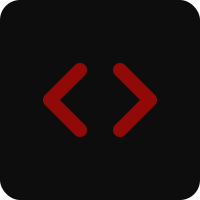

<p align="center">
  
  
  
  
</p>

<h1 align="center">
  <br>
  ramandhanu.cloud
</h1>

<p align="center">
  <strong>Modern DevOps & Cloud Engineering Portfolio Website</strong><br>
  <sub>Built with Next.js 16, TypeScript, and Docker</sub>
</p>

<p align="center">
  <a href="https://ramandhanu.cloud">🌐 Live Site</a> •
  <a href="#-quick-start">🚀 Quick Start</a> •
  <a href="#-docker-deployment">🐳 Docker</a> •
  <a href="https://github.com/arramandhanu">💻 GitHub</a>
</p>

---

## ✨ Features

| Feature | Description |
|---------|-------------|
| 🎨 **Modern UI** | Dark theme with red accent, terminal-style aesthetics |
| 📱 **Responsive** | Optimized for all devices |
| ⚡ **Fast** | Static generation with Next.js |
| 📧 **Contact Form** | Email integration via Web3Forms |
| 🐳 **Docker Ready** | One-command deployment |
| 🔒 **Secure** | Environment-based configuration |

---

## 🛠️ Tech Stack

<table>
<tr>
<td align="center" width="96">
  <br>
  <sub><b>Next.js 16</b></sub>
</td>
<td align="center" width="96">
  <br>
  <sub><b>TypeScript</b></sub>
</td>
<td align="center" width="96">
  <br>
  <sub><b>React 19</b></sub>
</td>
<td align="center" width="96">
  <br>
  <sub><b>CSS Modules</b></sub>
</td>
<td align="center" width="96">
  <br>
  <sub><b>Docker</b></sub>
</td>
</tr>
</table>

---

## 🚀 Quick Start

### Prerequisites

```bash
Node.js 20+
npm or yarn
```

### Installation

```bash
# Clone repository
git clone https://github.com/arramandhanu/ramandhanu.cloud.git
cd ramandhanu.cloud

# Install dependencies
npm install

# Setup environment
cp .env.example .env.local
# Edit .env.local with your Web3Forms key

# Start development server
npm run dev
```

### Environment Variables

| Variable | Description |
|----------|-------------|
| `NEXT_PUBLIC_WEB3FORMS_KEY` | Web3Forms API key for contact form |

---

## 🐳 Docker Deployment

### Build & Run Locally

```bash
# Build image
docker build -t aryaramandhanu/ramandhanu-cloud:latest \
  --build-arg NEXT_PUBLIC_WEB3FORMS_KEY=your_key_here .

# Run container
docker run -d -p 3000:3000 aryaramandhanu/ramandhanu-cloud:latest
```

### Docker Compose

```bash
# Create .env.local with your keys
echo "NEXT_PUBLIC_WEB3FORMS_KEY=your_key" > .env.local

# Build and run
docker compose up -d

# View logs
docker compose logs -f
```

### Pull from Docker Hub

```bash
docker pull aryaramandhanu/ramandhanu-cloud:latest
docker run -d -p 3000:3000 aryaramandhanu/ramandhanu-cloud:latest
```

---

## 📁 Project Structure

```
ramandhanu.cloud/
├── src/
│   ├── app/                # Next.js App Router
│   │   ├── layout.tsx      # Root layout
│   │   ├── page.tsx        # Homepage
│   │   └── globals.css     # Global styles
│   └── components/
│       ├── layout/         # Header, Footer
│       └── sections/       # Hero, About, Services, etc.
├── public/                 # Static assets
├── Dockerfile              # Multi-stage build
├── docker-compose.yml      # Container orchestration
└── .env.example            # Environment template
```

---

## 🔧 Development

```bash
# Start dev server
npm run dev

# Build for production
npm run build

# Start production server
npm run start

# Lint code
npm run lint
```

---

## 📄 License

MIT © [Arya Ramandhanu](https://ramandhanu.cloud)

---

<p align="center">
  <sub>Built with ❤️ using Next.js</sub>
</p>
